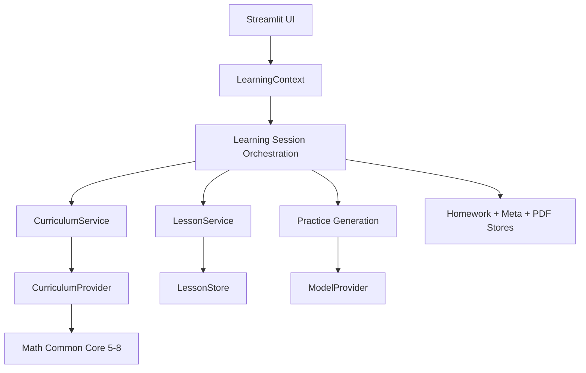

# Course Architecture

Top Math is moving from a daily worksheet generator to a pluggable learning
system. The daily worksheet remains the first user-facing workflow, but the
generation path now has explicit curriculum, lesson, practice, and mastery
boundaries.

## Goals

- Support Math grades 5, 6, 7, and 8 now.
- Keep curriculum knowledge pluggable so grades 9-12 or other subjects can be
  added without rewriting generation orchestration.
- Allow lesson content to be cached by subject, grade, and topic so ordinary
  practice can reuse prior teaching material.
- Keep student context separate from curriculum data and model-provider code.
- Preserve the existing storage, marking, PDF, and Streamlit workflows while the
  new architecture grows underneath them.

## Design Rules

- UI code builds a `LearningContext`; it does not select curriculum details by
  hand.
- Curriculum facts live behind `CurriculumProvider`, not in prompts or UI.
- Model providers remain interchangeable through the existing `ModelProvider`
  interface.
- Session orchestration owns the workflow order. Storage modules only persist
  data.
- New subjects or grade bands should register providers instead of editing the
  generator.

## Core Flow



## Domain Objects

`LearningContext` describes one requested learning session:

- `student_id`
- `subject`
- `grade_level`
- `mode`
- `include_lesson`
- `include_hints`
- `target_topic_id`
- `difficulty_policy`
- `recent_topics`

`CurriculumTopic` is the portable unit of curriculum:

- `id`
- `grade_level`
- `subject`
- `domain`
- `title`
- `standard`
- `prerequisites`
- `skills`
- `question_types`

`CurriculumProvider` is the plugin interface. A provider declares the subject and
supported grades, returns scopes, looks up topics, and chooses the next topic for
a context.

## Plugin Layout

```text
curriculum/
  registry.py
  math/
    common_core/
      provider.py
      grade5.json
      grade6.json
      grade7.json
      grade8.json
```

Adding Algebra 1 later should look like adding a provider and JSON files, not
editing the generator. Adding another subject should use the same provider
interface.

## Lesson Cache

Lessons are cached by stable curriculum identity:

```text
output/lessons/
  math/
    grade6/
      6.RP.A.1/
        intro_v1.json
```

When a lesson exists, generation receives the cached lesson and is instructed to
reuse it. When a new lesson is generated, the `LessonService` saves it for later
sessions. Reteach and challenge variants can be added as separate lesson types
without replacing the core introduction.

## Current PR Scope

This PR introduces the architecture and wires the daily generation path to it:

- Adds domain interfaces and data classes.
- Adds a Math Common Core 5-8 curriculum plugin.
- Adds a curriculum registry and curriculum service.
- Adds lesson cache storage and service helpers.
- Extends homework generation prompts with grade, topic, mode, and lesson
  options.
- Adds Today page controls for grade, topic, mode, lesson, and hints.
- Adds unit tests for the curriculum registry, topic selection, lesson cache, and
  prompt context.

The PR intentionally keeps existing daily storage, marking, history, PDFs, and
review workflows compatible.
